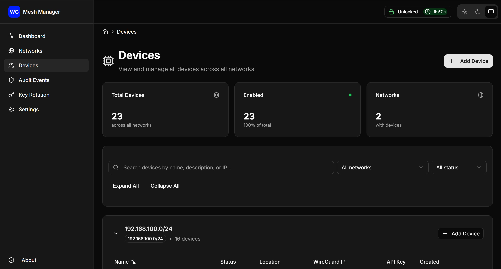

# WireGuard Mesh Manager (WMM)

A secret-management and configuration-deployment tool for WireGuard-based infrastructure.

## Overview

WMM provides secure management of WireGuard networks, locations, and devices with encrypted key storage and automated configuration generation.

## Screenshot



## Architecture

- **Frontend:** Next.js 16 (App Router), TailwindCSS v3.4.x, TypeScript
- **Backend:** Python FastAPI service for master-session auth, key management, and config generation
- **Database:** SQLite3 with encrypted private key storage
- **API:** Unversioned endpoints under `/api` (no `/v1` or versioned headers)

## Key Features

- Secure encrypted storage of WireGuard private keys
- Automatic configuration generation with intelligent endpoint selection
- Mesh topology: All devices connect directly to each other without a central WireGuard server
- Device self-service configuration retrieval with API key authentication
- IP allowlist and rate limiting for secure device access
- Management UI for networks, locations, and devices
- Audit logging for all operations

For detailed information about mesh topology architecture and configuration generation, see [Mesh Topology Architecture](docs/MESH_TOPOLOGY_ARCHITECTURE.md).

## Development Status

Core features are implemented, but review the deployment assumptions and security guidance before treating it as production-ready. Additional context lives in [TODO.md](./TODO.md) and the WireGuard assumptions guide in [docs/WIREGUARD_ASSUMPTIONS.md](./docs/WIREGUARD_ASSUMPTIONS.md).

## Getting Started

### Prerequisites

- Docker and Docker Compose (recommended)
- Python 3.11+ (for local development)
- Node.js 20+ (for local development)
- Git

### Quick Start with Docker (Recommended)

WMM is designed for self-hosted deployments. There is no shared/public service URL.

1. **Clone the repository:**

   ```bash
   git clone https://github.com/hanswolff/wireguard-mesh-manager
   cd wireguard-mesh-manager
   ```

2. **Start the services:**

   ```bash
   docker-compose up -d
   ```

3. **Access the application:**

   - Frontend UI: http://localhost:3000
   - Backend API: http://localhost:8000
   - API Documentation: http://localhost:8000/docs

4. **Initialize the database:**
   ```bash
   docker-compose exec backend make db-migrate
   ```

### Local Development Setup

#### Backend Development

1. **Set up the Python environment:**

   ```bash
   cd backend/
   python3 -m venv venv
   source venv/bin/activate  # On Windows: venv\Scripts\activate
   ```

2. **Install dependencies:**

   ```bash
   make install-dev  # Installs dependencies and sets up pre-commit hooks
   ```

3. **Initialize the database:**

   ```bash
   make db-migrate
   ```

4. **Start the development server:**
   ```bash
   make run  # Starts FastAPI server on http://localhost:8000
   ```

#### Frontend Development

1. **Install dependencies:**

   ```bash
   cd frontend/
   npm install
   ```

2. **Start the development server:**

   ```bash
   npm run dev  # Starts Next.js server on http://localhost:3000
   ```

3. **Build for production:**
   ```bash
   npm run build
   ```

### Common Development Tasks

#### Backend Commands

```bash
cd backend/

# Install dependencies
make install          # Production dependencies
make install-dev      # Development dependencies with pre-commit hooks

# Development
make run              # Start development server with hot reload
make test             # Run test suite
make lint             # Run code quality checks
make format           # Format code with black and ruff
make typecheck        # Run mypy type checking

# Database operations
make db-migrate       # Apply pending migrations
make db-revision MSG="description"  # Create new migration
make db-reset         # Reset database and reapply all migrations
```

#### Frontend Commands

```bash
cd frontend/

# Development
npm run dev           # Start development server
npm run build         # Build for production
npm run start         # Start production server

# Testing
npm test              # Run unit tests
npm run test:coverage # Run tests with coverage
npm run test:e2e      # Run end-to-end tests with Playwright
npm run test:all      # Run all tests

# Code Quality
npm run lint          # Run ESLint
npm run lint:fix      # Fix ESLint issues
npm run format        # Format code with Prettier
npm run type-check    # Run TypeScript type checking
```

## Testing

The project has comprehensive test coverage across backend and frontend:

### Backend Tests

- **Framework**: pytest with asyncio support
- **Coverage**: 51 test files covering API endpoints, services, and models
- **Database**: Temporary in-memory SQLite for test isolation

```bash
cd backend/
pytest -v                    # Run all tests with verbose output
pytest --cov=app             # Run with coverage report
pytest tests/test_authentication_middleware.py    # Run specific test file
```

### Frontend Tests

- **Unit Tests**: Jest with React Testing Library (22 test files)
- **E2E Tests**: Playwright (6 test files) for critical user flows
- **Accessibility**: jest-axe for a11y testing

```bash
cd frontend/
npm test                    # Run unit tests
npm run test:e2e           # Run E2E tests
npm run test:coverage      # Run with coverage
```

## Project Structure

```
wireguard-mesh-manager/
├── backend/                # Python FastAPI service
│   ├── app/               # Main application code
│   ├── migrations/        # Database migrations
│   ├── tests/            # Backend test suite
│   └── Makefile          # Development commands
├── frontend/              # Next.js application
│   ├── src/              # React source code
│   ├── tests/            # Frontend tests
│   └── package.json      # Node.js dependencies
├── docs/                 # Project documentation
├── docker-compose.yml    # Local development setup
└── README.md            # This file
```

## Deployment

### Production Deployment with Docker

1. **Set up environment variables:**

   ```bash
   # docker-compose.override.yml (production)
   version: '3.8'
   services:
     backend:
       environment:
         - DATABASE_URL=sqlite:///./data/wireguard.db
         - LOG_LEVEL=INFO
         - TRUSTED_PROXY_HEADERS=x-forwarded-for,x-forwarded-proto
         - TRUSTED_PROXY_COUNT=1
         # Set a secure bootstrap token for initial setup on fresh installs
         # This prevents unauthenticated takeover on first deployment
         # Generate a secure token: openssl rand -base64 32
         - BOOTSTRAP_TOKEN=<your-secure-bootstrap-token>
     frontend:
       environment:
         - NODE_ENV=production
         - NEXT_PUBLIC_API_URL=https://your-domain.com
   ```

   **Important:** Set `BOOTSTRAP_TOKEN` to a secure random value before first deployment. This token is required to unlock the master password on a fresh database (no encrypted data yet), preventing unauthenticated takeover. Once the database contains encrypted data (after first network/device creation), the bootstrap token is no longer required.

2. **Deploy with reverse proxy:**
   ```bash
   # Production deployment behind reverse proxy
   docker-compose -f docker-compose.yml -f docker-compose.override.yml up -d
   ```

### Reverse Proxy Configuration

The application requires a reverse proxy for TLS termination. See [Deployment Topology](docs/DEPLOYMENT_TOPOLOGY.md) for detailed configurations including:

- Nginx configuration examples
- Caddy configuration examples
- Security headers and rate limiting
- Trusted proxy setup
- SSL/TLS requirements

### File Permissions

```bash
# Production file permissions
sudo chown -R wmm:wmm /opt/wireguard-mesh-manager
sudo chmod 700 /opt/wireguard-mesh-manager/backend/data
sudo chmod 600 /opt/wireguard-mesh-manager/backend/data/wireguard.db
```

## Security Features

- **Encrypted Key Storage**: Private keys encrypted with master password
- **API Authentication**: Device API keys with IP allowlist restrictions
- **Rate Limiting**: Configurable rate limits on all endpoints
- **Security Headers**: HSTS, CSP, X-Frame-Options, etc.
- **Audit Logging**: Comprehensive audit trail of all operations
- **Container Hardening**: Non-root containers with minimal privileges

## Database reset and master password rotation

Use the automation in `scripts/new-database-with-master-password.sh` to tear down containers, delete `backend/data/wireguard.db`, optionally restore from a backup, and rotate the master password directly inside the backend container in one auditable flow.

```bash
scripts/new-database-with-master-password.sh \
  --new-password "<new-secure-password>" \
  --backup-path /backups/wireguard-mesh-manager-20240119-020000.json
```

See [docs/PRODUCTION_RUNBOOK.md](./docs/PRODUCTION_RUNBOOK.md#automated-clean-initialization-with-a-new-master-password) for full operational guidance and warnings about the destructive steps involved.

## Documentation

- [Product Specification](docs/PRODUCT_SPEC.md) - User personas and requirements
- [Mesh Topology Architecture](docs/MESH_TOPOLOGY_ARCHITECTURE.md) - Mesh topology design, endpoint selection, and implementation details
- [Threat Model](docs/THREAT_MODEL.md) - Security assumptions and controls
- [WireGuard Assumptions](docs/WIREGUARD_ASSUMPTIONS.md) - WireGuard behavior assumptions and operational expectations
- [Frontend Architecture](docs/FRONTEND_ARCHITECTURE.md) - Frontend structure and design decisions
- [Test Strategy](docs/test-strategy.md) - Testing approach and coverage goals
- [Deployment Topology](docs/DEPLOYMENT_TOPOLOGY.md) - Production deployment guide
- [Production Runbook](docs/PRODUCTION_RUNBOOK.md) - Operations and incident response
- [Docker Security](docs/docker-security.md) - Container security hardening guidance
- [API Versioning Policy](docs/api-versioning-policy.md) - API stability guarantees
- [Device Config API](docs/DEVICE_CONFIG_API.md) - Complete API documentation and examples
- [Device Config Fetcher](docs/DEVICE_CONFIG_FETCHER.md) - Client utility for retrieving generated configs
- [OpenAPI Specification](docs/device-config-openapi.yaml) - OpenAPI 3.0 spec for device config endpoints

## License

Apache License 2.0 - see [LICENSE](./LICENSE) for details.
